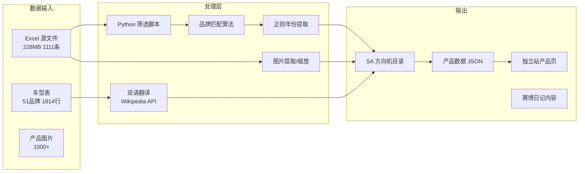

# 工具拓扑图

> 当前工具链的全景图：工具之间的关系、数据流向、瓶颈所在。
> 最后更新时间：2026-05-23

---

## 全景总览

```mermaid
graph TB
    subgraph Local["🖥️ 本地环境 (Windows)"]
        CC[Claude Code CLI]
        Chrome[Chrome 浏览器<br/>8个窗口: FB/IG/外贸通等]
        PM[Puppeteer MCP]
        PS[PowerShell 脚本]
        PY[Python 脚本]
        XLS[Excel / openpyxl]
        TS[Task Scheduler<br/>每日自动脚本]
        GH[gh CLI / Git]
    end

    subgraph AI["🧠 AI 模型"]
        Claude[Claude Opus<br/>(当前主力)]
        DS[DeepSeek V4<br/>Pro / Flash]
        MIMO[MiMo V2.5<br/>Pro / Basic]
    end

    subgraph Network["🌐 网络服务"]
        VPS[Vultr VPS<br/>香港]
        NG[Nginx 反向代理]
        Node[Node.js Express<br/>后端服务]
        PG[PostgreSQL 数据库]
        DP[deploy.php<br/>HTTP部署代理]
        SSL[SSL 证书]
    end

    subgraph Web["📦 Web 属性"]
        KIT[KITLAMT 独立站<br/>kitlamt.com]
        CD[赛博日记<br/>GitHub Pages]
        GHR[GitHub 仓库<br/>cyber-diary]
    end

    subgraph Lead["🎯 获客渠道"]
        FB[Facebook / IG]
        GM[Google Maps]
        WY[网易外贸通]
        EX[展会名录]
        HG[海关数据]
    end

    subgraph Comm["📱 通讯"]
        WX[微信 / 企业微信]
        FS[飞书]
        GMail[Gmail PWA]
        NGROK[ngrok 内网穿透]
    end

    subgraph Data["📊 数据资源"]
        DM[车型表<br/>51品牌 1814行]
        SA[SA方向机目录<br/>南美品牌]
        PD[产品图片库<br/>1000+ 图片]
    end

    %% 连接关系
    CC -->|CDP 连接| PM
    PM -->|驱动浏览器| Chrome
    CC -->|调用| Claude
    CC -->|调用| DS
    CC -->|调用| MIMO
    CC -->|执行| PS
    CC -->|执行| PY
    PY -->|openpyxl 操作| XLS
    XLS -->|数据来源| DM
    XLS -->|数据来源| SA
    XLS -->|图片操作| PD
    TS -->|每日9点| PS
    PS -->|git push| GH
    GH -->|push 触发| GHR
    GHR -->|Actions 部署| CD
    Chrome -->|社媒搜索| FB
    Chrome -->|地图搜索| GM
    Chrome -->|B2B辅助| WY

    CC -.->|SSH 被阻断| VPS
    DP -.->|HTTP 通道<br/>绕过SSH| VPS
    VPS -->|运行| NG
    VPS -->|运行| Node
    VPS -->|运行| PG
    NG -->|反向代理| KIT
    NG -->|代理| Node
    Node -->|查询| PG
    Node -->|写入| PG
    SSL -->|HTTPS| KIT
    KIT -->|产品浏览| Chrome
    FS -->|消息通道| CC
    WX -->|需要 ngrok| NGROK
    NGROK -->|穿透| VPS

    %% 数据流
    DM -->|筛选南美品牌| SA
    SA -->|产品目录| KIT
```

---

## 瓶颈分析 (🔴 = 当前瓶颈)

### 🔴 瓶颈 #1：SSH 被阻断

```
本地  ──SSH 被阻断──→ 香港 VPS
         ↓
     deploy.php (HTTP 443) ──→ VPS ✓
```

**根因：** 公司网络限制 SSH 协议（端口 22），但 HTTP/HTTPS 正常。
**当前方案：** deploy.php 通过 HTTP POST 上传 ZIP 部署（替代通道）。
**根治方案：** 
- SSH 换端口（如 443 或 2222）
- 或通过 Cloudflare Tunnel 转发
- 或 VPS 开 VPN（WireGuard）后走 VPN SSH

### 🔴 瓶颈 #2：浏览器登录态依赖

```
Puppeteer MCP ──CDP→ Chrome ──→ Facebook/IG
                          ↑
                    需要用户手动启动 Chrome
                    且调试端口可能变化
```

**根因：** Chrome 需要先以调试模式启动，CDP 才能连接。用户关闭 Chrome 后需要重新启动。
**当前方案：** 用户手动启动 Chrome 带 `--remote-debugging-port=18800`。
**根治方案：** 
- 写一个开机自启脚本，以调试模式启动 Chrome
- 或使用 Chrome 的 `--remote-debugging-pipe` 模式（无需固定端口）

### ⚠️ 瓶颈 #3：多模型配置碎片化

```
Claude Code → Claude Opus
           → DeepSeek V4 (API Key)
           → MiMo V2.5 (API Key)
           → MiMo V2.5 Pro (API Key)
```

**根因：** 三个模型分别配置，密钥散落在配置文件和记忆中。
**当前方案：** 手动切换模型 `/model`。
**根治方案：** 根据任务类型自动路由（文本→DeepSeek、图片→MiMo、复杂推理→Claude）。

### ⚠️ 瓶颈 #4：Excel 大文件处理

```
openpyxl 读取 228MB 文件 → read_only 模式 → 不能操作图片
                                    ↘ 普通模式 → 内存溢出
```

**根因：** openpyxl 在大文件模式下无法同时读取数据和图片。
**当前方案：** 分两步（先 read_only 读数据，再普通模式提取图片）。
**根治方案：** 用 pandas 处理数据 + PIL 处理图片，分离关注点。

### ✅ 已解决的瓶颈

| 原来问题 | 解决方案 |
|---------|---------|
| 日记内容散落在对话中 | 赛博日记 + 四维一体格式 |
| 跨会话丢失上下文 | MEMORY.md 持久化记忆 |
| 手动部署 VPS | deploy.php HTTP 代理 |
| VPS 救火模式 | 部署脚本 + 后续 bootstrap.sh |
| 车型表缺漏 | 交叉比对补 149 行 |

---

## 数据流向图



---

## 工具链演进路线

```
第1周 (5/12-5/16)          第2周 (5/17-5/23)         下阶段 (建议)
─────────────────          ─────────────────         ─────────────────
Claude Code 初体验          KITLAMT 独立站上线         SSH 通道根治
向日葵远程控制              deploy.php 部署通道        VPS 一键初始化脚本
小米/DeepSeek API           车型表 v9 双语             工具拓扑图 → 自动化编排
记忆系统搭建                SA 目录 v1-v5              AI 自动路由模型
外贸获客 5 渠道             赛博日记 + GitHub Pages    客户收集 → 自动化流水线
车型表 50 品牌              Task Scheduler 每日推送    独立站 SEO + 转化优化
```

---

*本图持续更新。发现新瓶颈或解决现有瓶颈时，随时更新。*
