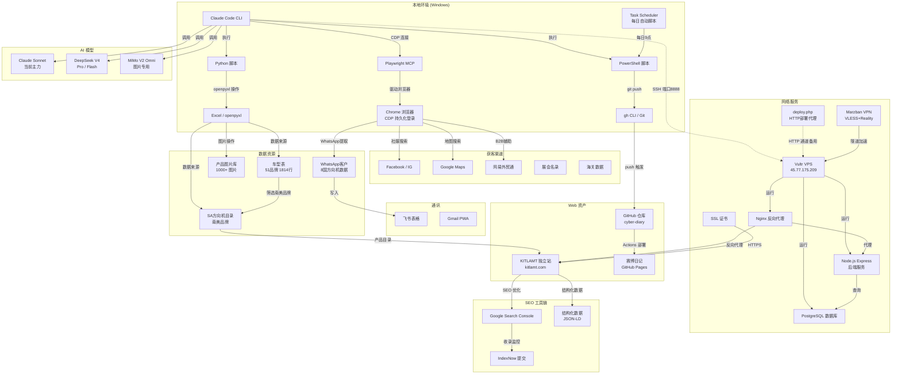
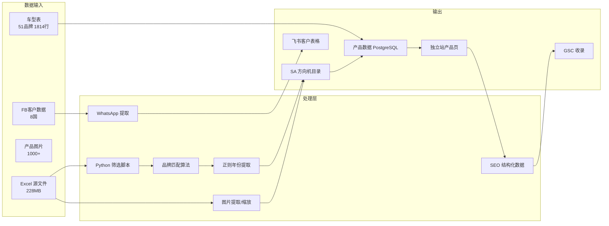

# 工具拓扑图

> 当前工具链的全景图：工具之间的关系、数据流向、瓶颈所在。
> 最后更新时间：2026-06-19

---

## 全景总览


```mermaid
graph TB
    subgraph Local["本地环境 (Windows)"]
        CC[Claude Code CLI]
        Chrome[Chrome 浏览器<br>CDP 持久化登录]
        PM[Playwright MCP]
        PS[PowerShell 脚本]
        PY[Python 脚本]
        XLS[Excel / openpyxl]
        TS[Task Scheduler<br>每日自动脚本]
        GH[gh CLI / Git]
    end

    subgraph AI["AI 模型"]
        Claude[Claude Sonnet<br>当前主力]
        DS[DeepSeek V4<br>Pro / Flash]
        MIMO[MiMo V2 Omni<br>图片专用]
    end

    subgraph Network["网络服务"]
        VPS[Vultr VPS<br>45.77.175.209]
        NG[Nginx 反向代理]
        Node[Node.js Express<br>后端服务]
        PG[PostgreSQL 数据库]
        DP[deploy.php<br>HTTP部署代理]
        SSL[SSL 证书]
        VPN[Marzban VPN<br>VLESS+Reality]
    end

    subgraph Web["Web 资产"]
        KIT[KITLAMT 独立站<br>kitlamt.com]
        CD[赛博日记<br>GitHub Pages]
        GHR[GitHub 仓库<br>cyber-diary]
    end

    subgraph Lead["获客渠道"]
        FB[Facebook / IG]
        GM[Google Maps]
        WY[网易外贸通]
        EX[展会名录]
        HG[海关数据]
    end

    subgraph Comm["通讯"]
        FS[飞书表格]
        GMail[Gmail PWA]
    end

    subgraph Data["数据资源"]
        DM[车型表<br>51品牌 1814行]
        SA[SA方向机目录<br>南美品牌]
        PD[产品图片库<br>1000+ 图片]
        LEADS[WhatsApp客户<br>8国方向机数据]
    end

    subgraph SEO["SEO 工具链"]
        GSC[Google Search Console]
        IDX[IndexNow 提交]
        SCHEMA[结构化数据<br>JSON-LD]
    end

    CC -->|CDP 连接| PM
    PM -->|驱动浏览器| Chrome
    CC -->|调用| Claude
    CC -->|调用| DS
    CC -->|调用| MIMO
    CC -->|执行| PS
    CC -->|执行| PY
    PY -->|openpyxl 操作| XLS
    XLS -->|数据来源| DM
    XLS -->|数据来源| SA
    XLS -->|图片操作| PD
    TS -->|每日9点| PS
    PS -->|git push| GH
    GH -->|push 触发| GHR
    GHR -->|Actions 部署| CD
    Chrome -->|社媒搜索| FB
    Chrome -->|地图搜索| GM
    Chrome -->|B2B辅助| WY
    Chrome -->|WhatsApp提取| LEADS
    LEADS -->|写入| FS

    CC -.->|SSH 端口8888| VPS
    DP -.->|HTTP 通道备用| VPS
    VPN -->|隧道加速| VPS
    VPS -->|运行| NG
    VPS -->|运行| Node
    VPS -->|运行| PG
    NG -->|反向代理| KIT
    NG -->|代理| Node
    Node -->|查询| PG
    SSL -->|HTTPS| KIT
    KIT -->|SEO 优化| GSC
    GSC -->|收录监控| IDX
    KIT -->|结构化数据| SCHEMA

    DM -->|筛选南美品牌| SA
    SA -->|产品目录| KIT
```

---

## 瓶颈分析

### 已解决

| 原来问题 | 解决方案 | 解决时间 |
|---------|---------|---------|
| SSH 端口 22 被阻断 | SSH 换端口 8888 | 5/27 |
| 浏览器登录态丢失 | Chrome CDP 持久化 user-data-dir | 6/17 |
| 手动部署 VPS | deploy.php HTTP 代理 | 5/22 |
| 日记内容散落 | 赛博日记 + 四维一体 | 5/23 |
| 跨会话丢失上下文 | MEMORY.md 持久化 | 5/14 |
| 车型表数据缺漏 | 交叉比对补 149 行 | 5/21 |
| Puppeteer MCP 不稳定 | 迁移到 Playwright MCP | 6/18 |
| MySQL 密码泄露 | 更换密码 + 权限收紧 | 6/11 |

### 当前瓶颈

**🔴 PayPal Live Secret 泄露**
PayPal Live Secret Key 已泄露（曾出现在日志中），需要在 PayPal 开发者后台重新生成。

**🟡 SEO 索引未完全覆盖**
Google Search Console 已提交 sitemap，但部分产品页仍未被索引，需持续监控。

**🟡 WhatsApp 获客自动化还不稳定**
FB 抓取脚本依赖 Chrome 登录态，偶发 session 失效需要手动重登。

---

## 数据流向图


```mermaid
flowchart LR
    subgraph Input["数据输入"]
        A1[Excel 源文件<br>228MB]
        A2[车型表<br>51品牌 1814行]
        A3[产品图片<br>1000+]
        A4[FB客户数据<br>8国]
    end

    subgraph Process["处理层"]
        B1[Python 筛选脚本]
        B2[品牌匹配算法]
        B3[图片提取/缩放]
        B4[正则年份提取]
        B5[WhatsApp 提取]
        B6[SEO 结构化数据]
    end

    subgraph Output["输出"]
        C1[SA 方向机目录]
        C2[产品数据 PostgreSQL]
        C3[独立站产品页]
        C4[飞书客户表格]
        C5[GSC 收录]
    end

    A1 --> B1
    A1 --> B3
    B1 --> B2
    B2 --> B4
    B4 --> C1
    B3 --> C1
    A2 --> C2
    C1 --> C2
    C2 --> C3
    A4 --> B5
    B5 --> C4
    C3 --> B6
    B6 --> C5
```

---

## 工具链演进路线

```
第1周 (5/12-5/16)      第2周 (5/17-5/23)      第3-4周 (5/24-6/4)     当前 (6/5+)
─────────────────      ─────────────────      ─────────────────      ─────────────
Claude Code 初体验      KITLAMT 独立站上线      SSH 端口换8888          SEO 全面上线
DeepSeek/MiMo API      deploy.php 部署通道     Marzban VPN 搭建        GSC 监控建立
记忆系统搭建            车型表双语 1814行        股票App 开发            PayPal 待修复
外贸获客5渠道           SA 目录 v1-v5           汽配Schema 95%覆盖      Chrome CDP持久化
车型表50品牌            赛博日记上线             WhatsApp 获客体系       Playwright MCP
```

---

*本图持续更新。发现新瓶颈或解决现有瓶颈时，随时更新。*
